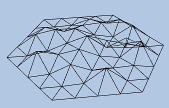

# 1단계: 3D 개발 기초

https://doc.babylonjs.com/features/introductionToFeatures/chap1/first_scene/

## 3D 기초개념 키워드

### Mesh

1. `Vertex` : 점
2. `Facet` : `Vertex`가 3개 모인 삼각형 형태의 면
3. `Mesh` : 렌더링 단위 객체 (`Facet` 집합 + 렌더링 정보)
    - `Model` : 여러 `Mesh`를 묶은 자산 (논리적 개념)
4. `Scene` : Model/Mesh가 존재하는 곳



> 바빌론에서 사용법:
> 
> - 미리 정의된 메시 사용
> - 사용자 직접 정의
> - 3D 디자인 소프트웨어로 export/import

### Vertex / Index Buffer

- 버텍스 배열(Vertex Buffer)
→ 정점 데이터 목록 (position, normal, uv 등)
- 인덱스 배열(Index Buffer)
→ 어떤 정점들을 연결해서 삼각형을 만들지 정의한 목록


### Scene

모든 메시가 배치되어서 보이는 무대

카메라, 조명 등도 이곳에 배치

### Camera

- universal
    
    기본 카메라
    
    1인칭에 가장 적합하며 키보드 ,마우스, 터치, 게임패드 등 모든 조작 방식과 호환
    
    충돌 감지, 중력 적용 가능
    
- arcRotate
    
    목표물 중심으로 회전
    
    항상 지정된 목표 위치를 향함
    
    
    

### Lights

메시의 밝기와 색상에 영향을 주어 메시가 어떻게 보이는지 결정하는데 사용

### Normal

법선 벡터

표면이 어느 방향을 향하고 있는지를 나타냄

조명 계산에 사용


## Coordinate Space: 좌표계

- Space: 좌표계. 특정 기준으로 해석되는 좌표 집합 ✅ ~~물리적 3d 공간~~ ❌
- Matrix: 좌표계를 변환하는 수학 도구
- Transformation : 한 공간의 좌표를 다른 공간으로 변환하는 과정

### Transform : Local, World

- `Local` : 부모 기준 모델 좌표
    
    ```jsx
    Car // (10, 5, 0)
     └── Wheel // (0, -3, 0)
    ```
    
    → Wheel 은 Car기준으로 y축 -2 위치
    
- `World` : 전체 기준 모델 좌표
    
    ```jsx
    // (0, 0, 0) 월드의 원점
    car.position = (10, 5, 0)
    wheel.position = (10, 2, 0)
    
    wheel.parent = car
    ```
    

### Matrix

3D에서 위치 좌표를 변환하는 장치

→ `v` = v* S * R * T`

→ 계산 순서: `S → R → T`

---

```jsx
// Vertex
(x, y, z, 1)

// Matrix
| a  b  c  p |
| d  e  f  q |
| g  h  i  r |
| tx ty tz s |
```

- 왼쪽 위 3×3 `a~i` → 선형 변환(로컬 좌표계 변환)
    - 스케일 (scale)
    - 회전 (rotation)
    - 축 방향 변경
- 마지막 행 `tx, ty, tz` → 위치 이동값(position)
- 마지막 열 `p, q, r, s` → 원근 계산. 아핀 변환(단순 평행 이동): `0 0 0 1`
- 동차좌표 : 이동 처리를 위해, `Vertex`의 4번째 요소로 1을 추가하여 계산

---

```jsx
// Matrix * Vertex 계산 방법
x' = x*a + y*d + z*g + 1*tx
y' = x*b + y*e + z*h + 1*ty
z' = x*c + y*f + z*i + 1*tz
w' = x*p + y*q + z*r + 1*s
```

- `w`` : 원근 효과를 만들기 위해, 나눗셈을 수행하도록 만들어진 보조 좌표

---

### Space


```jsx
Local Space
  ↓     // Model matrix
World Space
  ↓     // View matrix
View Space
  ↓     // Projection matrix
Clip Space
  ↓     // Viewport
Screen Space
```

1. **Local Space**

모델 자기 자신 기준 좌표계

→ 월드 어디에 배치될지 모르는 상태

---

1. **World Space**

모든 객체가 공존하는 절대 3D 공간

→ 이제 객체는 World 내부에 존재

> Model Matrix : `Local` → `World`
> 

https://youtu.be/h9Z4oGN89MU?t=1069&si=NKt_ie56NFMST0hW


---

1. **View Space (Camera Space)**

카메라 기준으로 다시 계산된 공간

→ 월드를 움직여서 “카메라가 원점에 있는 것처럼” 만든 공간

> View Matrix : `World` → `View`
> 
- 카메라는 항상 원점 `(0,0,0)`
- 카메라는 `-Z` 방향을 본다고 가정 (OpenGL 관례)

> ⚠️ 카메라는 실제로 움직이는 게 아니라 **월드를 반대로 움직인다**
> 

---

1. **Clip Space**

Projection Matrix을 거친 4D 공간

> Projection Matrix: `(x, y, z)` → `(x`, y`, z`, w`)`
> 
1. 원근 효과 준비
2. FOV 적용 (카메라 시야각)
3. Aspect ratio 반영 (화면의 가로:세로 비율)
4. Near/Far 범위 압축 (카메라가 볼수 있는 깊이 범위)

> **NDC** (Normalized Device Coordinates)
> 
> 
> 진짜 원근이 적용되는 순간
> 
> GPU 변환 : `(x', y', z', w')` → `(x'/w', y'/w', z'/w')` `(-1~1)`
> 

---

1. **Screen Space**

실제 픽셀 좌표

> Viewport Transform : `x_ndc (-1~1)` → `0 ~ screen_width`
> 

```jsx
// 예) 모니터 픽셀 위치로 배치
x_ndc = -1 → 0px
x_ndc =  1 → 1920px
```

## Texture & UV Map


### Texture

3D 물체의 표면에 붙이는 2D 이미지

### ✅ UV Map

3D 모델의 표면을 2D 이미지 공간에 펼쳐놓은 좌표 설계도

`(u, v)` → 2d 이미지(텍스쳐)에 해당하는 좌표

좌표 수치 범위: 0~1 (0: 시작점, 1: 끝점)

→ 이미지 크기 상관없이 비율로 표현하기 위함

**왜 0~1 범위냐?**

값이 커질수록 표현 가능한 다음 값까지의 간격이 커진다

예시:

- 0~1 : 0.0000001
- 0~100 : 0.00001

### ✅ 구에서 텍스쳐가 찌그러져 보이는 이유

기하학+그래픽스의 기본 원리 때문

→ 구를 uv평면으로 표현할 때의 구조적 한계: 극점으로 갈수록 좁아진다

**[ 예시: 지구본 ]**

- 적도는 둘레가 가장 큰 원
- 극점으로 갈수록 원의 둘레가 점점 작아짐
- 하지만, uv 평면에서는 동일한 길이의 직사각형으로 표현

→ 좁은 둘레에 uv평면을 우겨넣기때문에 찌그러지게 나타난다.

### 렌더링 과정

1. 화면에 삼각형이 그려진다
2. 삼각형 내부의 각 픽셀에 대해
3. 그 픽셀의 UV를 계산한다 (보간)
4. 계산된 UV 위치에서 텍스처 색을 읽는다
5. 그 색을 화면에 찍는다

### 예제

https://playground.babylonjs.com/#20OAV9#8623

- 반복(scale)
    
    텍스쳐를 n번 반복해서 사용하겠다는 의미
    
    ```jsx
    texture.uScale = 2
    texture.vScale = 4
    ```
    
    → 텍스쳐를 x축으로 2번 반복, y축으로 4번 반복하게 우겨넣기
    
- 오프셋(offset)
    
    텍스쳐의 시작위치를 밀어버리는 것
    
- Texture Wrap
    - repeat(default) : 0~1 범위를 넘어가면 반복
    - clamp : 0~1 범위를 넘어가면 끝값을 유지
    - mirror : 0~1 범위를 넘어가면 뒤집혀서 반복

---

## glTF / glb

### glTF(Graphics Language Transmission Format)

웹용 3D 표준 포맷. JSON기반 구조 + 외부파일

**파일 구조:**

- `.gltf` : 구조 설명 JSON
    - Scene : 루트 컨테이너
    - Node : 트랜스폼을 가지는 객체(position, rotation, scale)
    - Mesh : 정점 데이터 묶음
    - Material : 셰이더 설정 + 텍스쳐 정보
- `.bin` : 실제 정점 데이터
- `.png` : 텍스쳐(있을 경우)

### glb

glTF를 통째로 압축해서 하나의 파일로 만든것

**파일 구조:** 

- Header
- JSON
- Binary

---

## ✅ Shader

GPU에서 실행되는 프로그램. GPU 렌더링 파이프라인

→ 3D 물체를 화면에 어떻게 그릴지 계산

https://youtu.be/C8YtdC8mxTU?si=Hg96iDhulxvQXRS0&t=256

### GPU 파이프라인


1. **Vertex Shading**
    
    정점 하나마다 실행되는 위치 계산(Coordinate space) → [Coordinate Space: 좌표계](https://www.notion.so/Coordinate-Space-3144931c860780a691e6d16ec8983e3d?pvs=21) 
    
2. **Rasterization** 
    - 삼각형(facet) 내부를 픽셀 후보(fragment)로 변환 `vertex` → `pixel`
    - 보간: vertex shader가 넘긴 값들을 픽셀단위 데이터로 보간
        - world position : 정확한 조명, 반사, 그림자
        - normal : 픽셀 단위 조명 계산
        - uv좌표 : 텍스쳐 샘플링 위치
        - color : 그라디언트 색 표현
        - depth(z값) : 어떤 픽셀이 앞서있는지
    
    
    
3. **Fragment Shading**
    
    Rasterization가 넘겨준 보간된 데이터와 uniform(light, camera 등)를 토대로 각 픽셀의 색 계산
    

## Material

Shader를 감싸고 있는 설정 객체

→ Shader를 구성/관리하는 추상화 계층

→ Shader는 저수준의 언어이기 때문에 Material로 관리

### 구조적 흐름

Mesh → Material → Shader → GPU 실행

### Material의 역할

- 어떤 Shader를 사용할 지 결정
- Shader에 전달할 값을 관리

### 주요 종류

- Standard : 기본 조명 모델
- Emissive : 조명과 무관하게 스스로 발광
- PBR : 물리 기반 렌더링
- Shader Material : 직접 Shader 로직을 커스텀